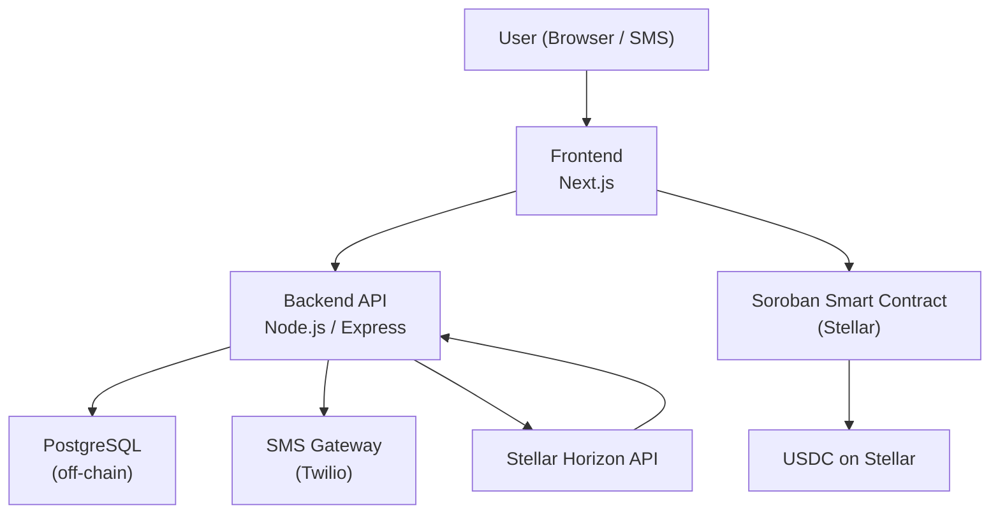
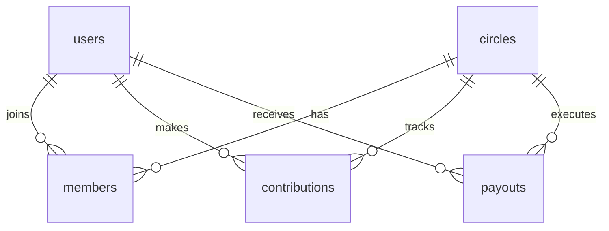

# Design Document: EsusuChain

## Overview

EsusuChain is a trustless savings circles platform that digitizes the traditional African Ajo/Esusu practice. Members form groups, contribute USDC each cycle, and one member receives the pooled payout — enforced entirely by a Soroban smart contract on Stellar with no admin custody of funds.

The architecture is a three-tier system:
- **Frontend**: Next.js web app (mobile-first)
- **Backend API**: Node.js/Express REST API with PostgreSQL
- **Smart Contract**: Soroban contract on Stellar holding and distributing USDC

The key design principle is that the smart contract is the source of truth for funds and payout logic. The off-chain backend handles user identity, notifications, and dashboard data aggregation.

---

## Architecture



**Key flows:**
1. Wallet interactions (contribute, deposit) go directly from the frontend to the Soroban contract via the Stellar SDK
2. The backend listens to Stellar events via Horizon to sync on-chain state to the off-chain DB
3. Notifications are triggered by the backend after detecting on-chain events

---

## Components and Interfaces

### Frontend (Next.js)

**Pages:**
- `/` — Landing / wallet connect
- `/dashboard` — User's circles overview
- `/circles/new` — Create circle form
- `/circles/[id]` — Group dashboard
- `/circles/join/[inviteCode]` — Join circle flow

**Key client-side responsibilities:**
- Stellar wallet connection (Freighter wallet via `@stellar/freighter-api`)
- Signing and submitting Soroban transactions
- Real-time dashboard updates via polling or WebSocket

### Backend API (Node.js/Express)

**REST Endpoints:**

| Method | Path | Description |
|--------|------|-------------|
| POST | `/api/users` | Register/login user with wallet address |
| PUT | `/api/users/:id/phone` | Update phone number |
| POST | `/api/circles` | Create circle (off-chain record + trigger contract deploy) |
| GET | `/api/circles/:id` | Get circle details |
| POST | `/api/circles/:id/join` | Join circle |
| GET | `/api/circles/:id/members` | List members and contribution status |
| POST | `/api/contributions` | Record confirmed contribution (called after on-chain confirmation) |
| GET | `/api/circles/:id/transactions` | Get transaction history |
| POST | `/api/webhooks/stellar` | Receive Stellar Horizon event callbacks |

### Soroban Smart Contract

**Contract Interface (Rust/Soroban):**

```rust
// Initialize a new circle
fn initialize(
    env: Env,
    creator: Address,
    contribution_amount: i128,  // in stroops of USDC
    cycle_length_days: u32,
    max_members: u32,
    deposit_amount: i128,
    payout_order: PayoutOrder,  // Fixed | Randomized
) -> Result<(), ContractError>

// Member joins and stakes deposit
fn join(env: Env, member: Address) -> Result<u32, ContractError>  // returns payout_position

// Member contributes for current cycle
fn contribute(env: Env, member: Address, amount: i128) -> Result<(), ContractError>

// Trigger payout check (called by backend or any member)
fn try_payout(env: Env) -> Result<bool, ContractError>

// Return deposit to member after circle completes
fn claim_deposit(env: Env, member: Address) -> Result<(), ContractError>

// Read-only queries
fn get_state(env: Env) -> CircleState
fn get_member_status(env: Env, member: Address) -> MemberStatus
fn get_payout_schedule(env: Env) -> Vec<PayoutEntry>
```

**Contract State:**

```rust
pub struct CircleState {
    pub status: CircleStatus,          // Pending | Active | Completed
    pub current_cycle: u32,
    pub total_cycles: u32,
    pub cycle_end_timestamp: u64,
    pub contribution_amount: i128,
    pub deposit_amount: i128,
    pub members: Vec<Address>,
    pub payout_order: Vec<Address>,    // finalized after circle goes active
    pub contributions: Map<(Address, u32), bool>,  // (member, cycle) -> paid
    pub defaulters: Vec<Address>,
}
```

---

## Data Models

### PostgreSQL Schema (Off-Chain)

```sql
-- Users
CREATE TABLE users (
    id          UUID PRIMARY KEY DEFAULT gen_random_uuid(),
    wallet_address VARCHAR(64) UNIQUE NOT NULL,
    phone       VARCHAR(20),           -- E.164 format
    created_at  TIMESTAMPTZ DEFAULT NOW()
);

-- Circles
CREATE TABLE circles (
    id              UUID PRIMARY KEY DEFAULT gen_random_uuid(),
    contract_address VARCHAR(64) UNIQUE NOT NULL,
    name            VARCHAR(100) NOT NULL,
    contribution_amount NUMERIC(18,7) NOT NULL,  -- USDC
    deposit_amount  NUMERIC(18,7) NOT NULL DEFAULT 0,
    cycle_length_days INTEGER NOT NULL,
    max_members     INTEGER NOT NULL,
    payout_order    VARCHAR(10) NOT NULL,  -- 'fixed' | 'randomized'
    status          VARCHAR(10) NOT NULL DEFAULT 'pending',  -- pending | active | completed
    current_cycle   INTEGER NOT NULL DEFAULT 0,
    invite_code     VARCHAR(32) UNIQUE NOT NULL,
    creator_id      UUID REFERENCES users(id),
    created_at      TIMESTAMPTZ DEFAULT NOW()
);

-- Members
CREATE TABLE members (
    id              UUID PRIMARY KEY DEFAULT gen_random_uuid(),
    user_id         UUID REFERENCES users(id),
    circle_id       UUID REFERENCES circles(id),
    payout_position INTEGER,
    deposit_paid    BOOLEAN DEFAULT FALSE,
    UNIQUE(user_id, circle_id)
);

-- Contributions
CREATE TABLE contributions (
    id              UUID PRIMARY KEY DEFAULT gen_random_uuid(),
    user_id         UUID REFERENCES users(id),
    circle_id       UUID REFERENCES circles(id),
    cycle_number    INTEGER NOT NULL,
    status          VARCHAR(10) NOT NULL DEFAULT 'pending',  -- pending | paid | defaulted
    tx_hash         VARCHAR(128),
    created_at      TIMESTAMPTZ DEFAULT NOW(),
    UNIQUE(user_id, circle_id, cycle_number)
);

-- Payouts
CREATE TABLE payouts (
    id              UUID PRIMARY KEY DEFAULT gen_random_uuid(),
    circle_id       UUID REFERENCES circles(id),
    cycle_number    INTEGER NOT NULL,
    recipient_id    UUID REFERENCES users(id),
    amount          NUMERIC(18,7) NOT NULL,
    tx_hash         VARCHAR(128),
    executed_at     TIMESTAMPTZ
);
```

### Key Relationships



---

## Correctness Properties

A property is a characteristic or behavior that should hold true across all valid executions of a system — essentially, a formal statement about what the system should do. Properties serve as the bridge between human-readable specifications and machine-verifiable correctness guarantees.

### Property 1: Contribution amount invariant

*For any* circle and any member contribution transaction, the USDC amount transferred to the smart contract must equal exactly the circle's configured contribution amount — no more, no less.

**Validates: Requirements 4.1, 4.5**

---

### Property 2: Payout equals pooled contributions

*For any* completed cycle in any circle, the total USDC released in the payout must equal the sum of all confirmed contributions for that cycle (contribution_amount × number of paying members).

**Validates: Requirements 5.1**

---

### Property 3: Payout position uniqueness

*For any* active circle, each member must have a distinct Payout_Position — no two members share the same position, and positions form a contiguous sequence from 1 to N.

**Validates: Requirements 3.2, 6.2, 6.3**

---

### Property 4: No payout before all contributions

*For any* cycle in any circle, the smart contract must not release a payout unless the count of confirmed contributions for that cycle equals the total member count.

**Validates: Requirements 5.1, 5.5**

---

### Property 5: Deposit round trip

*For any* member who completes all cycles without defaulting, the smart contract must return the full staked deposit amount to that member's wallet — the deposit balance after claim equals the deposit balance before joining.

**Validates: Requirements 10.5**

---

### Property 6: Contribution status consistency

*For any* circle and cycle, the set of members recorded as "paid" in the off-chain database must be a subset of members whose contribution transactions are confirmed on the Stellar ledger.

**Validates: Requirements 4.2, 9.2**

---

### Property 7: Cycle advancement monotonicity

*For any* circle, the current cycle number must only ever increase — it must never decrease or reset after advancing.

**Validates: Requirements 5.3**

---

### Property 8: Member count bounds

*For any* circle, the number of members who have joined must never exceed the configured max_members value, and must be at least 2 before the circle can become active.

**Validates: Requirements 2.5, 3.4**

---

### Property 9: Invite code uniqueness

*For any* two distinct circles, their invite codes must be different — no two circles share the same invite code.

**Validates: Requirements 2.4**

---

### Property 10: Notification delivery coverage

*For any* cycle window opening event, every member of the circle who has not yet paid must receive exactly one "time to pay" notification — no member is skipped, no member receives duplicates.

**Validates: Requirements 8.1**

---

## Error Handling

### Smart Contract Errors

| Error | Condition | Response |
|-------|-----------|----------|
| `AlreadyMember` | User calls `join` but is already a member | Return error, no state change |
| `CircleFull` | User calls `join` but max_members reached | Return error |
| `WrongAmount` | Contribution amount ≠ configured amount | Reject transaction |
| `WindowClosed` | Contribution outside Cycle_Window | Reject transaction |
| `AlreadyPaid` | Member calls `contribute` twice in same cycle | Reject transaction |
| `NotAllPaid` | `try_payout` called but not all members paid | Return false, no payout |
| `CircleNotActive` | Actions called on pending/completed circle | Return error |

### API Errors

- All endpoints return structured JSON errors: `{ "error": "code", "message": "human readable" }`
- 400 for validation errors, 404 for not found, 409 for conflicts (duplicate membership), 500 for unexpected errors
- Stellar transaction failures are surfaced with the Horizon error code

### Frontend Error Handling

- Wallet not connected → prompt to connect before any action
- Transaction rejected by user → show dismissible toast, no state change
- Network errors → retry with exponential backoff (max 3 attempts)
- Contract errors → map error codes to user-friendly messages (e.g. `WrongAmount` → "Contribution must be exactly $X USDC")

---

## Testing Strategy

### Unit Tests

Unit tests cover specific examples, edge cases, and error conditions:

- Smart contract: each error condition (wrong amount, window closed, already paid, circle full)
- API: input validation (E.164 phone format, contribution amount > 0, member count bounds)
- Payout schedule generation: fixed order matches join order, randomized order is a permutation
- Invite code generation: codes are URL-safe and unique across test runs
- Notification formatting: correct message templates for each notification type

### Property-Based Tests

Property tests validate universal correctness across randomly generated inputs. The project uses **fast-check** (TypeScript) for frontend/API properties and **proptest** (Rust) for Soroban contract properties.

Each property test runs a minimum of **100 iterations**.

Tag format: `Feature: esusu-chain, Property {N}: {property_text}`

**Property test mapping:**

| Property | Test Target | Library |
|----------|-------------|---------|
| P1: Contribution amount invariant | Soroban contract | proptest |
| P2: Payout equals pooled contributions | Soroban contract | proptest |
| P3: Payout position uniqueness | API + contract | fast-check |
| P4: No payout before all contributions | Soroban contract | proptest |
| P5: Deposit round trip | Soroban contract | proptest |
| P6: Contribution status consistency | API sync logic | fast-check |
| P7: Cycle advancement monotonicity | Soroban contract | proptest |
| P8: Member count bounds | API + contract | fast-check |
| P9: Invite code uniqueness | API | fast-check |
| P10: Notification delivery coverage | Notification service | fast-check |

### Integration Tests

- Full contribution cycle: create circle → join → contribute (all members) → verify payout executed
- Default scenario: one member doesn't contribute → verify payout delayed, deposit held
- Deposit return: complete all cycles → verify deposit returned to each member
- Cross-border scenario: members with different wallet addresses all contribute successfully

### Testing Infrastructure

- Stellar testnet (Futurenet) for contract integration tests
- Local PostgreSQL instance for API tests
- Mock Twilio client for SMS notification tests
- Stellar SDK test helpers for wallet simulation
